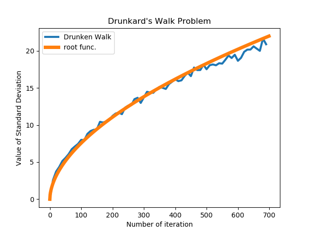
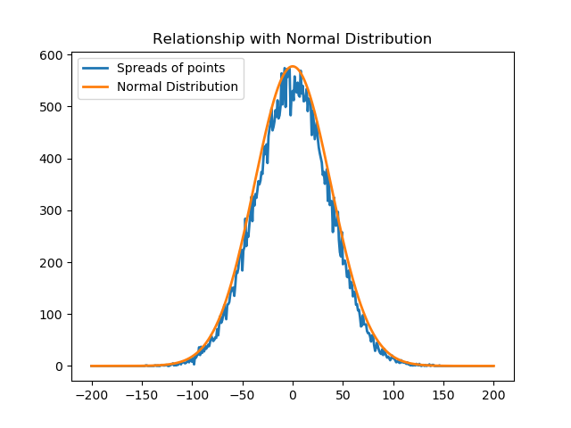
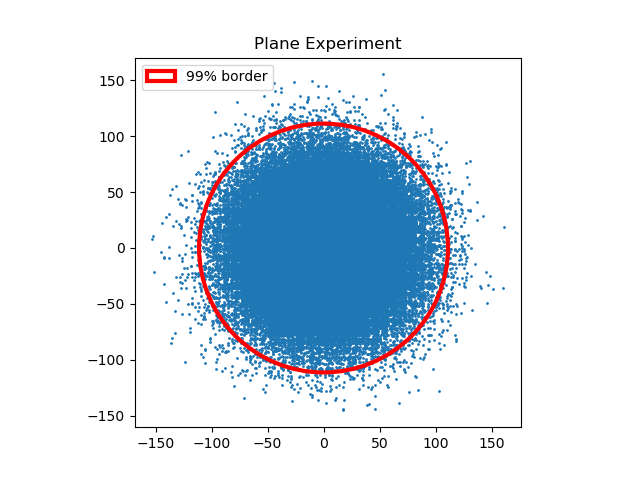
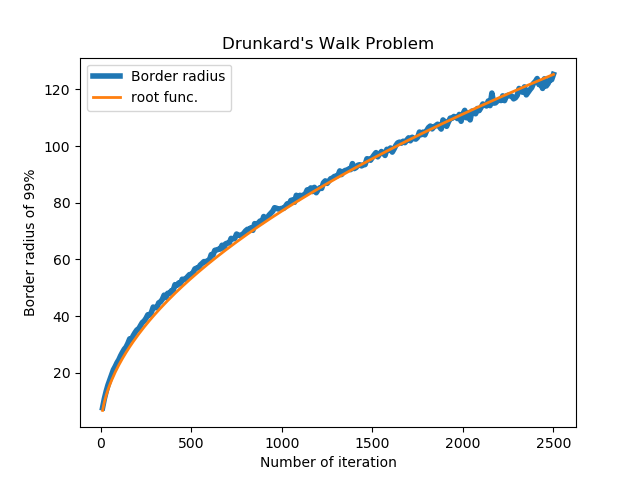
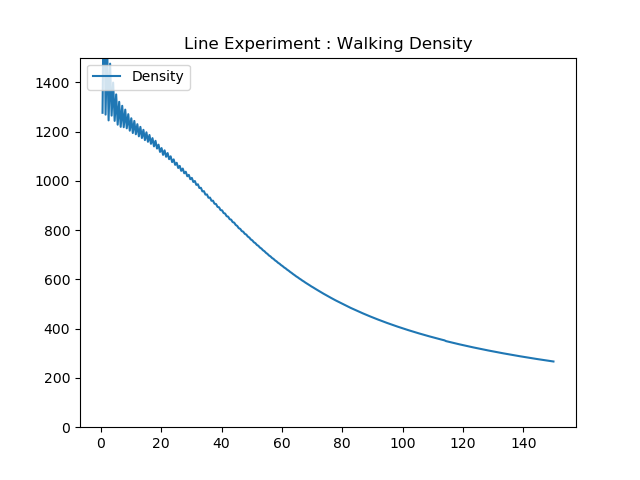
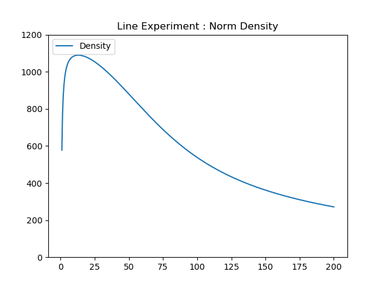
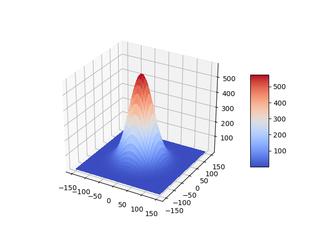
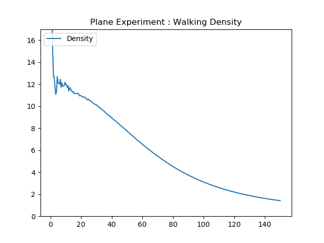
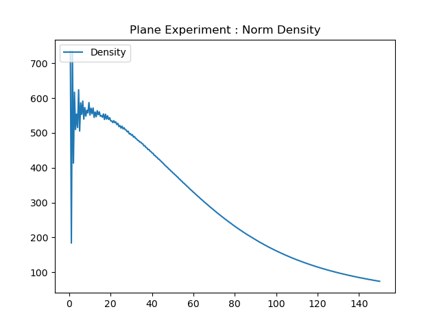

# ◉ Drunkard's Walk Problem

성균관대학교 물리학과 김범준 교수님의 연구를 동기로 탐구를 진행하였습니다.

### ✔ 마구걷기 문제(Drunkard's Walk Problem)란?

임의의 점에서 출발하여 무작위로 움직이는 대상에 대한 문제이다.  
예를 들어 수직선에서 0인 지점에서 출발하여 단위시간당 양의 방향 또는 음의 방향으로 무작위로 움직이는 상황에서 대상의 수가 많을 경우 일종의 경향성을 띄게 되는데 이를 마구걷기 문제라 한다.

### ✔ 1차원 마구걷기에 대한 탐구

- 수직선에서 무작위로 좌우로 움직이는 경우  
  수직선의 원점에서 출발하여 좌우로 무작위 운동을 하는 입자가 있을 때 원점으로부터의 거리의 표준편차를 구하면 다음과 같은 그래프를 얻을 수 있다(1500개 입자를 700번 반복함).

  

  주황색 그래프는 시간에 따른 표준편차의 값을 나타내고 파란색 그래프는 이와 가장 유사한 루트함수(ax^(1/b))이다. 직관적으로 알 수 있듯 표준편차의 그래프는 루트함수의 꼴을 따른다.

- 정규분포와의 관계

  

  같은 위치에 있는 점들의 개수를 바탕으로 그래프를 그려보면 다음과 같이 정규분포의 형태를 띄고 있음 알 수 있다(50000개 입자를 2000번 반복).

### ✔ 2차원 마구걷기에 대한 탐구

- 마구걷기 문제의 2차원 확장  
  이번에는 가만히 있는 것을 포함하여 2차원에서 8방위로 무작위 운동하는 경우이다. 왼쪽 그림에서 알 수 있듯 대부분의 입자가 특정 원 안에 모여 있는 것을 알 수 있다(120000개의 입자를 2000번 반복함).

  오른쪽 그림은 점의 99%를 포함하는 원의 반지름을 반복 횟수에 따라 나타낸 그래프이다. 이 역시 루트함수의 꼴을 따르는 것을 알 수 있다.

  </img>
  </img>

### ✔ 마구걷기와 밀도

마구걷기 과정을 거치면서 특정 지역((0, 0) 부근)에 입자가 모여있는 것을 관찰할 수 있었다. 이제 따라

밀도 = (영역 내의 점의 개수) / (선택한 영역의 길이 또는 넓이)

로 정의하고 1차원과 2차원 마구걷기 상황에서의 밀도에 관한 탐구를 진행하였다. 또한 정규분포와의 관계를 이용하여 밀도의 양상을 비교해본다.

- 1차원 마구걷기

  다음과 같이 밀도를 정의하고 마구걷기 상황과 정규분포에서의 밀도를 비교하였다.

  선밀도 = (영역 내의 점의 개수) / (영역의 길이)

  </img>
  </img>

  두 그래프의 개형이 비슷함을 통해 마구걷기 상황에서 입자의 분포는 정규분포를 따르고 있음을 알 수 있다.  
  다만 마구걷기 상황에서 걸음의 단위가 존재(반복횟수당 1의 거리를 움직임)하므로 짧은 거리에서 연속적인 정규분포와 차이를 관찰할 수 있다.

- 2차원 마구걷기

  2차원 정규분포는 y축을 따라 1차원 정규분포의 배율을 조정하여 구성하였으며 마구걷기 상황과 같은 단위길이를 이용하였다.  
  2차원 정규분포의 3차원 그래프는 다음과 같다.

  

  다음과 같이 밀도를 정의하고 마구걷기 상황과 정규분포에서의 밀도를 비교하였다.

  면밀도 = (영역 내의 점의 개수) / (영역의 넓이)

  </img>
  </img>

  두 그래프의 개형은 비슷하나 1차원 밀도와 차이가 있음을 관찰할 수 있다. 짧은 거리에서도 비슷한 양상을 보였으며 이는 2차원 정규분포를 구성할 때 마구걷기의 단위길이를 모방했기 때문이라고 추측된다.

### ✔ 탐구의 확장 가능성

- n차원으로의 확장  
  1, 2차원 마구걷기 상황에서 출발점으로부터의 거리는 루트함수, 밀도는 정규분포와 같은 양상을 보였다.  
  이에 따라 n차원 마구걷기 상황을 가정하고 시뮬레이션을 진행한다면 거리는 루트함수, 밀도는 정규분포를 따를 것임을 추론해볼 수 있다.

- 마구걷기의 이용  
  대상의 위치를 모를 때, 그 존재 가능 영역을 특정하는 데 이용될 수 있다.

  가령 술에 취한 현섭이가 데리러 오라고 전화한지 약 2시간이 지났고 나는 대체로 1km/h의 속력으로 이동할 때 그래프 상에서 내 위치를 파악한 뒤, 수색 범위를 좁힐 수 있을 것이다. 대충 반지름 √2 km 원 그리고 뒤져보면 발견할 수 있지 않을까?
